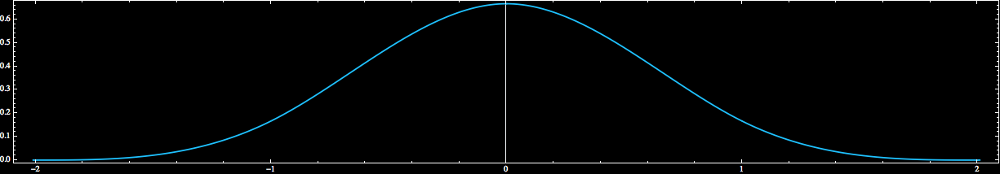
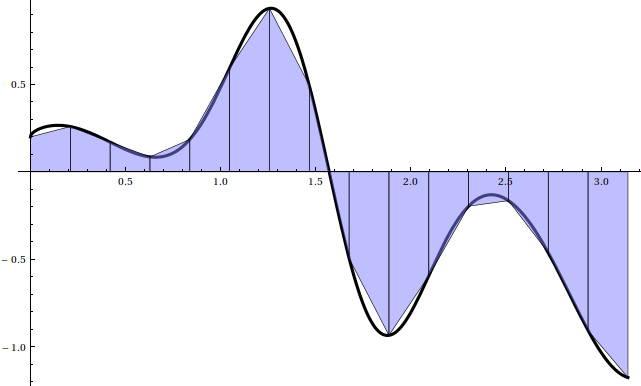
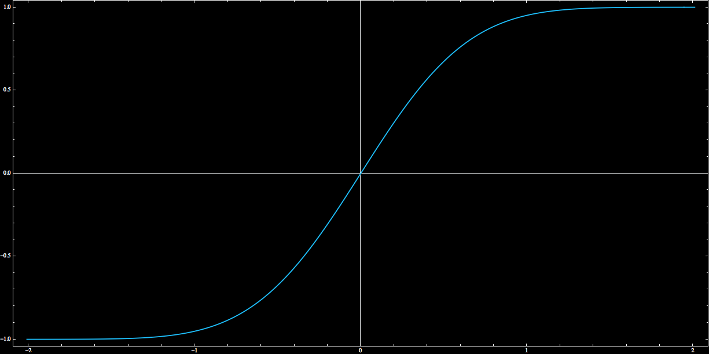

autoscale: true
slidenumbers: true


## Numerical Analysis in Boost.Math

 Nick Thompson

---

> Numerical analysis is the study of algorithms for solving the problems of continuous mathematics

-- [Lloyd N. Trefethen](http://people.maths.ox.ac.uk/trefethen/NAessay.pdf)

---

## Topics in Numerical Analysis

- Numerical Integration/Differentiation
- Interpolation
- Signal denoising and compression
- Root finding/optimization
- ODE/PDE solvers
- Numerical linear algebra (GMRES/CG/QR)

---

## Boost has tools for many of these

. . . but we will discuss only *new* features of Boost.Math, landing in 1.66


---

## First, a thanks

[John Maddock](https://github.com/jzmaddock) maintains [Boost.Math](https://github.com/boostorg/math).

This is a heroic effort, and Boost.Math would die without him.

The features I added would have been stillborn without John's help.

---

> It’s always been 'We can’t do it that way. It would be too slow.'
You know what’s slow? Spending all day trying to figure out why it doesn’t work. That’s slow. That’s the slowest thing I know.

-- [Paul Phillips](https://www.youtube.com/watch?v=TS1lpKBMkgg)

---

## Goals of Boost.Math

1) Accuracy
2) Stability
3) Optimal asymptotic complexity
4) Speed

---

## Unfortunate fact

Every numerical algorithm an undergrad can understand breaks in production


---

## Examples

- Lagrange interpolation is *ill-conditioned*
- Gaussian elimination is *ill-conditioned w/o pivoting*
- Cubic spline interpolation is *ill-conditioned*
- Numerical differentiation by finite differences is *ill-conditioned*
- Jacobi iteration *too slow*
- Euler's method for ODEs *too slow*
- Newton-Cotes quadrature *too slow*

---

## Reliability Model

HPC calcs: 100 nodes, 64 threads/node, 2 week compute => $${\sim}10^{10}$$ seconds of compute

Assuming each function call (at the top of the callstack) takes $$1\mu\mathrm{s}$$, then there are $${\sim}10^{16}$$ function calls in the average HPC task

---

## Reliability Model

If any of these $$n \approx 10^{16}$$ calls segfaults, leaks/uses too much memory, or *leaks an abstraction*, the whole job dies, or the result is worthless.

Let $$p$$ denote the probability of failure for each function call.
Assuming independence

$$
P(\mathrm{Job\, succeeds}) = \binom{n}{0}(p)^{n-n}(1-p)^{n} = (1-p)^{n}
$$

---

## Reliability Model

On gcloud, this example computation costs $${\sim}$75,000$$.
What is your tolerance for job failure?

Assume 1% can fail. Then we must have

$$
p_{\mathrm{fail}} \le 1 - \exp(\log(.99)/10^{16}) \approx 10^{-18}
$$

---

## Reliability Model

HPC codes cannot *segfault*, *leak memory*, or *break abstractions*, except with vanishing probability.

If the algorithms in boost.math weren't advanced, *they'd be useless*.

---


## Interpolation

Given a function known at points, you want to know its value at points between the known points.

Examples:

- Create a graph from a list of data points.
- Find values between points of a numerical solution to an ODE
- "Create" data between sensors


---

##  Two types of interpolation

Equispaced: Data is taken every millisecond

Irregular: Data is known wherever a sensor is placed

---

## Equispaced Interpolation has a bad reputation

because complex analytic basis functions + equispaced data = catastrophic ill-conditioning


---

## Equispaced interpolation can be fast and stable


using basis functions of compact support

---

## Building smooth basis functions of compact support

Start with a box function

$$B_{0}(x) :=
\begin{cases}
1 & |x| \le 1/2 \\
0 & |x| > 1/2
\end{cases}
$$

and smooth with integration

$$
B_{m+1}(x) := \int_{x-1/2}^{x+1/2} B_{m}(t) \, \mathrm{d}t
$$


---

## $$B_{3}(x)$$



$$B_{3} \in C^{2}_{0}([-2, 2])$$

---

## Build an interpolant with $$B_{3}$$ using translates and scalings

Define $$B_{m,k}(x) := B_{m}\left(\frac{x-a -hk}{h}  \right)$$ and write

$$
s(x) = \sum_{k=-1}^{n} \alpha_{k} B_{3,k}(x)
$$

Satisfying the interpolation condition $$s(x_j) = y_j$$ requires solving a tridiagonal linear system.

---

## Equispaced interpolation via [cubic\_b\_spline](http://www.boost.org/doc/libs/1_65_1/libs/math/doc/html/math_toolkit/interpolate/cubic_b.html)

```cpp
#include <boost/math/interpolators/cubic_b_spline.hpp>
using boost::math::cubic_b_spline;
std::vector<double> v(n);
// initialize v ...
double t0 = 0; // initial time
double h = 0.01; // spacing between points
cubic_b_spline<double> spline(f.begin(), f.end(), t0, h);
// Interpolate:
double y = spline(0.3);
// Interpolate derivative:
double yp = spline.prime(0.3);
```

---

## cubic\_b\_spline complexity

$$\mathcal{O}(n)$$ constructor, $$\mathcal{O}(1)$$ evaluation

---

## cubic\_b\_spline accuracy

$$
f \in C^{4}([a,b]) \implies \left\|f - s\right\|_{\infty} \le \frac{h^{4}}{16} \left\|f^{(4)}\right\|_{\infty}
$$

---

## Irregular interpolation via [barycentric\_rational](http://www.boost.org/doc/libs/1_65_1/libs/math/doc/html/math_toolkit/interpolate/barycentric.html)

Given a list of unequally spaced points $$x_0 < x_1 < \cdots < x_{n-1}$$ and a list of values $$f(x_0), f(x_1), \ldots, f(x_{n-1})$$
we wish to construct a rational function $$r$$ such that $$r(x_{j}) = f(x_{j})$$


---

## Rational functions

can be written as

$$
r(x) = \frac{\sum_{j=0}^{n} a_{j}x^{j}}{ \sum_{k=0}^{m} b_{k}x^{k}}
$$

Interpolating with generic rational functions is unwise, as the denominator can be zero, leading to poles in the interpolation domain.

---

## Rational interpolants

with $$n = m$$ can always be written in the *barycentric form*

$$
r(x) = \frac{\sum_{k=0}^{n} \frac{ w_{k} }{x-x_k} f(x_{k})}{\sum_{k=0}^{n} \frac{w_{k}}{x-x_k}}
$$


---

## Barycentric weights

Different weights can be chosen to produce interpolants of varying character. For Boost's barycentric_rational, we have

$$
w_{k} := (-1)^{k-d}\sum_{i \in J_{k}}\prod_{j=i, j\ne k}^{i+d} \frac{1}{|x_k - x_j|}
$$

where

$$
J_{k} := \{i \colon k -d \le i \le k \land 0\le i \le n-d\}
$$


---

## Using barycentric_rational


```cpp
#include <boost/math/interpolators/barycentric_rational.hpp>

std::vector<double> x(n);
std::vector<double> y(n);
// initialize x, y . . .
int approximation_order = 3;
boost::math::barycentric_rational<double> b(x.begin(), x.end(), y.begin(), approximation_order);
// Interpolate:
double y = b(12.7);
```

---

## [barycentric\_rational](http://www.boost.org/doc/libs/1_65_1/libs/math/doc/html/math_toolkit/interpolate/barycentric.html) complexity

$$\mathcal{O}(n)$$ constructor and $$\mathcal{O}(n)$$ evaluation.

---

## [barycentric\_rational](http://www.boost.org/doc/libs/1_65_1/libs/math/doc/html/math_toolkit/interpolate/barycentric.html) accuracy and stability

If $$h := \max_{i} (x_{i+1} - x_{i})$$ then

$$f \in C^{d+2}[a, b] \implies
\left\| f - r \right\| \le h^{d+1}(b-a)\frac{ \left\|f^{(d+2)} \right\|}{d+2}
$$

Special cases have been proven forward stable, but no general proof is known


---

## Chebyshev polynomials

are defined by a three-term recurrence

$$
T_{0}(x) := 1, \quad T_{1}(x) := x,  \quad T_{n+1}(x) := 2xT_{n}(x) - T_{n-1}(x)
$$

For $$x \in [-1,1]$$, we can write $$x = \cos(\theta)$$ and we have the identity $$T_{n}(\cos(\theta)) = \cos(n\theta)$$.

---

## Chebyshev polynomials

are orthogonal over the interval $$[-1,1]$$ with respect to the weight function $$(1-x^2)^{-1/2}$$ so

$$
\int_{-1}^{1} \frac{T_{n}(x)T_{m}(x)}{\sqrt{1-x^2}} \, \mathrm{d}x = \frac{\pi}{2-\delta_{m0}} \delta_{mn}
$$

---

## Among all polynomials

Chebyshev polynomials have minimal uniform norm deviation from zero on $$[-1, 1]$$, i.e., $$\left\|T_{n}\right\|_{\infty, [-1,1]} = 1$$.

---


## Chebyshev interpolation

Suppose a function $$f$$ is expensive to evaluate.

By projecting it onto a span of Chebyshev polynomials, we can sacrifice a tiny bit of accuracy and gain massive increases in speed.

In addition, we gain a fast numerical integration scheme, as well as a stable numerical differentiation scheme.

---

## Chebyshev series

Just as a Fourier series is an expansion in complex exponentials, a Chebyshev series is an expansion Chebyshev polynomials

$$
f(\theta) = \sum_{n \in \mathbb{Z} } c_{n} \exp(i n\theta)\qquad \mathrm{(Fourier\, series)}
$$

$$
g(x) = \sum_{n \in \mathbb{N}} a_{n}T_{n}(x) \qquad \mathrm{(Chebyshev\, series)}
$$

---

## Orthogonality

gives us a way of computing the coefficients of the expansion

$$
a_{m} = \frac{(2-\delta_{m0})}{\pi} \int_{0}^{\pi} f(\cos(\theta)) \cos(m\theta) \, \mathrm{d}\theta
$$

The integrand is periodic, so trapezoidal quadrature is exponentially convergent.

---

## Trapezoidal quadrature to recover Chebyshev series coefficients

$$
\int_{0}^{\pi} f(\cos(\theta)) \cos(m\theta) \, \mathrm{d}\theta
\approx
\frac{\pi}{n}\sum_{k=0}^{n-1} f(\cos((k+1/2)\pi/n)) \cos(m(k+1/2)\pi/n)
$$

This is a DCT-II for $$x_{k} = f(\cos((k+1/2)\pi/n))$$, and hence all coefficients can be recovered in $$\mathcal{O}(n\log n)$$ time.


---

## Chebyshev transform in boost.math

```cpp

#include <boost/math/special_functions/chebyshev_transform.hpp>

auto f = [](double x) { return sin(x);};

chebyshev_transform<double> cheb(f, 0.0, M_PI);

// Interpolate:
double x = cheb(0.3);
// Integrate over [0, M_PI]
double I = cheb.integrate();
// Differentiate:
double xp = cheb.prime(0.3);
```

---

## Gotchas with Boost.Math's Chebyshev transform

Since we require a DCT-II, we have a dependency on FFTW.

Pull requests to eliminate this dependency are welcome!

(This shouldn't be too bad: We only require a power of two DCT-II)

---

## Quadrature

is the numerical art of evaluating integrals

$$
I_{a}^{b}[f] := \int_{a}^{b} f(x) \, \mathrm{d}x \in \mathbb{R}
$$

---

## Quadrature

Most integrals do not have "analytic representations", such as

$$
\int_{-\infty}^{\infty} e^{-x^2} \, \mathrm{d}x = \sqrt{\pi}
$$

so numerical quadrature much be used.

---

## Trapezoidal Rule



(Image courtesy of [Jeremy Kun](https://jeremykun.com))

---

## Trapezoidal Rule

Let $$x_{k} := a + kh$$ for $$k \in \{0, \ldots n\}$$. Then the trapezoidal rule is given by

$$
\int_{a}^{b} f(x) \, \mathrm{d}x \approx h\left[ \frac{f(x_0)+ f(x_n)}{2} + \sum_{k=1}^{n-1} f(x_{k})  \right] =: T_{h}[f]
$$

---

## Trapezoidal Rule

If $$f \in C^{2}[a, b]$$ then the error of the trapezoidal rule is

$$
\left| I_{a}^{b}[f] - T_{h}[f] \right| \le \frac{b-a}{2}h^2\left\|f''\right\|_{\infty}
$$

The $$\mathcal{O}(h^2)$$ error implies that this method is *too slow*.


---

## Euler-Maclaurin Expansion


Let $$f \in C^{m}[a,b]$$. Then

$$
\int_{a}^{a+T} f(x) \, \mathrm{d}x = T_{h}[f] - \sum_{j=1}^{\lceil m/2 \rceil } \frac{b_{2j} h^{2j}}{(2j)!} (f^{(2j-1)}(a+T) - f^{(2j-1)}(a))
+ (-1)^{m}h^{m}\int_{a}^{a+T} B_{m}\left(\frac{x-a}{h} \right)f^{(m)}(x) \, \mathrm{d}x
$$

where $$b_{2j}$$ are the *Bernoulli numbers* and $$B_{m}$$ are the Bernoulli polynomials.

---

## Euler-Maclaurin expansion

If $$f \in C^{m}[a,a+T]$$ is periodic, then

$$
\int_{a}^{a+T} f(x) \, \mathrm{d}x = T_{h}[f]
+ (-1)^{m}h^{m}\int_{a}^{a+T} B_{m}\left(\frac{x-a}{h} \right)f^{(m)}(x) \, \mathrm{d}x
$$

If $$f$$ is smooth and periodic, then *the trapezoidal rule converges faster than any power of $$h$$*.

---

## Trapezoidal quadrature in [Boost.Math](http://www.boost.org/doc/libs/1_65_1/libs/math/doc/html/math_toolkit/quadrature/trapezoidal.html)

```cpp
#include <boost/math/quadrature/trapezoidal.hpp>
using boost::math::quadrature::trapezoidal;
auto f = [](double x) { return 1/(5 - 4*cos(x)); };
double I = trapezoidal(f, 0.0, 2*M_PI);
```

---

## Periodic integrands

are a pretty big restriction for exponential convergence.

Could we make a variable transformation that allows exponential convergence for any $$C^{\infty}$$ integrand?

---

## Variable transformations

Let $$x = g(t)$$. Then

$$
\int_{a}^{b} f(x) \, \mathrm{d}x = \int_{g^{-1}(a)}^{g^{-1}(b)} f(g(t)) g'(t) \, \mathrm{d}t
$$

No one has developed a transform such that $$f\circ g \cdot g'$$ is periodic on the interval $$(g^{-1}(a), g^{-1}(b))$$, but it's easy enough the ensure that $$(g^{-1}(a), g^{-1}(b)) = (-\infty, \infty)$$ . . .

---

### $$g(t) := \tanh\left(\frac{\pi}{2} \sinh(t) \right)$$



---

## Tanh-sinh quadrature

Applying the trapezoidal rule to $$f\circ g\cdot g'$$ with transform $$g(t) := \tanh\left(\frac{\pi}{2} \sinh(t) \right)$$ gives us *tanh-sinh* quadrature.

For analytic $$f$$, this scheme is *exponentially convergent*.

---

## Tanh-sinh in boost.math

```cpp
#include <boost/math/quadrature/tanh_sinh.hpp>
tanh_sinh<double> integrator;
auto f = [](double x)->double { return 1/(1 + pow(tan(x), 3)); };
double Q = integrator.integrate(f, (double) 0, half_pi<double>());
```

---

## Send us pull requests! We need

- Wavelet transforms
- RiskShrink denoising
- Sparse grid quadrature
- Monte Carlo integration (Frank-Wolfe bayesian quadrature)
- Multivariate interpolation

---
